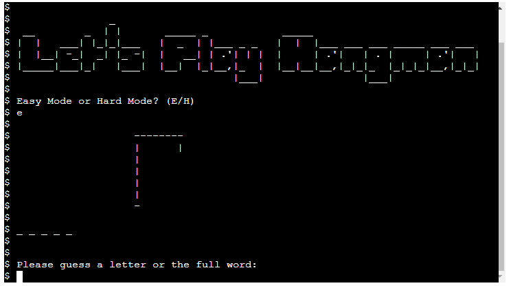

# Let's Play Hangman



## Contents

1. [Strategy](#strategy)
   1. [Project Goals](#project-goals)
   2. [User Goals](#user-goals)
2. [Flowchart](#flowchart)
3. [User Stories](#user-stories)
   1. [Player User Stories](#player-user-stories)
4. [Technology Design](#technology-design)
   1. [User Interface](#user-interface)
5. [Technologies Used](#technologies-used)
   1. [Languages](#languages)
   2. [Applications](#applications)
   3. [Packages](#packages)
6. [Validation](#validation)
7. [Testing](#testing)
8. [Deployment](#deployment)
   1. [Forking the Github Repository](#forking-the-github-repository)
   2. [Making a Local Clone](#making-a-local-clone)
   3. [Heroku](#heroku)

## Strategy

### Project Goals

The goals for Let's Play Hangman were to create a randomized version of the classic game Hangman by using random word packages and ASCII artwork.

### User Goals

Players should be able to decide between an easy or hard game mode, observe the hangman character easily and input their guesses and restart the game when either they guess all the letters or run out of attempts. 


## Flowchart

The flowchart for Let's Play Hangman can be found [here](assets/images/flowchart/hangman_flowchart.pdf). 

## User Stories

### Player User Stories

1. I would like to be able to pick an easy or hard game, for players of different ages and skill levels.
2. I would like to be able to see what letters I have played already to keep track of my guesses. 
3. I would like to be able to see a graphic depiction of the hangman, to keep track of how close I am to losing the game. 
4. I would like to be able to restart the game once completedd until I am finished playing. 
5. I would like random words to be used, to make sure that I don't get duplicate words everytime I play. 

## Technology Design

### User interface

Anyone who has played hangman knows that it's all about being able to draw the character throughout the stages of play, and populating the blank spaces with correct guesses. This meant that to create the game properly I would have to use ASCII art and underscores to emulate the traditional way the game is played. 

For example, the various stages of the hangman are held in [constants.py](constants.py). 

```
"""
   --------
   |      |
   |      O
   |     \\|/
   |      |
   |     / \\
   -
"""
```
Here is a demonstration of the final stage of the hangman. 

## Technologies Used

### Languages

- [Python 3](https://www.python.org/) - Was used solely to create this project.


### Applications

- [Git](https://git-scm.com/) - Used for version control.

- [Github](https://github.com/) - Holds the repository of the project.

- [Gitpod](https://gitpod.com/) - The IDE used to create the application.

- [Heroku](https://www.heroku.com) - Used to deploy the application.

- [Lucidchart](https://lucid.co/product/lucidchart) - Used to make flowchart.

- [TinyPNG](https://tinypng.com) - Used to compress images.

- [ASCII Art Generator](https://patorjk.com/software/taag/#p=display&f=Graffiti&t=Type%20Something%20) - Created ASCII art using this generator.


### Packages

- [Random-Word](https://pypi.org/project/Random-Word/) - Was used to generate random words to populate the game with.

## Validation 

The files for this program were validated using [PEP8](http://pep8online.com/) and screenshots of the validations can be found [here](assets/images/validation). No errors were found apart from small warnings due to the ASCII artwork, but these warnings don't create problems in the programme and are needed for the graphics to be created. 

## Testing

Full information on the testing of this application can be found in [TESTING.md](TESTING.md)

## Deployment

### Forking the GitHub Repository

1. Go to the page of the relevant Github repository
2. Click 'Fork' on the top right.
3. This will have cloned the repository to your Github account.

### Making a Local Clone

1. Go to the page of the relevant Github repository
2. Click on the 'Code' button.
3. Clone the repository using HTTPS by copying the link.
4. Open Git Bash.
5. Navigate to the directory where your clone will go.
6. Type ```git clone {your clone url}```
7. Press Enter.
8. Your local clone will be in the specified directory.

### Heroku

These are the steps used to deploy this application to Heroku:

1. Create an account at [heroku.com](https://.heroku.com/)
2. Create a new app with your app name and region.
3. Click on create app.
4. Navigate to the "Settings" tab on your app dashboard.
5. Under Config Vars, add any sensitive data (creds.json for example)
6. Set your buildpacks in the correct order, in this case ```Python``` and ```NodeJS``` in that order.
7. In the deploy tab, click 'Connect to Github'.
8. Search for your repository and click connect.
9. Choose the correct branch for your application
10. If desired, click on "Enable Automatic Deploys", which updates the deployed version with the latest commit you have pushed to Github. 

## Credits

### Coding tips and tricks

- Replacing spaces in a string so that the list comprehension would work when replacing hidden letters:
[StackOverflow, Cédric Julien](https://stackoverflow.com/questions/8270092/remove-all-whitespace-in-a-string)

- List comprehension: 
[W3Schools](https://www.w3schools.com/python/python_lists_comprehension.asp)

- Python's ```enumerate()``` function:
[Real Python](https://realpython.com/python-enumerate/)

- Info on how minCorpusCount works for Random-Word package (alternatively known as Wordnik API):
[StackOverflow, fehguy](https://stackoverflow.com/questions/11583339/what-is-minimum-corpus-frequency-for-terms-in-wordnik-api)

### Acknowledgments

Thank you to the Code Institute Slack Community for help with small issues and problems I couldn't figure out on my own. 

Special thanks to my mentor Akshat Garg for his help and guidance with this project. 
